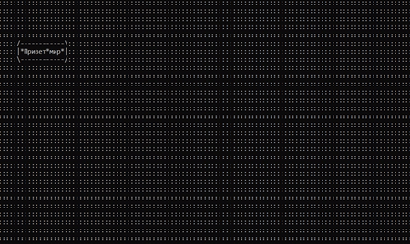

# ConsoleInterface
ConsoleInterface - микро библиотека под язык C# для постраение простых UI в консоли.

## Использование
Простой пример использования *ConsoleInterface* выглядет так:
```C#
class Program
{

    delegate void DelegateElement(); //Делегат для обратотчиков
    static UiInterface ui = new UiInterface(40, 150); // создание Дисплея (Высота, Ширина)
    static void Main(string[] args)
    {
        DelegateElement Function;

        Function = cliced_button;
        Button buttonName = new Button(5, 10, Function, "Привет мир"); // Создание кнопки (x,y,Делегат функции обработчика, текст)

        ui.add(buttonName, "buttonNameString"); //Добавление обьекта на экран
        ui.display();
        
    }
    static void cliced_button()
    {
        ui.get_element("buttonNameString").text = "Ура я нажал на кнопку".ToCharArray();
    }
    
}
```

## Добовление Entry(Поле ввода)

Использование entry выглядет так:
```C#
class Program
    {
        delegate void DelegateElement(); //Делегат для обратотчиков
        static UiInterface ui = new UiInterface(40, 150); // создание Дисплея (Высота, Ширина)
        static void Main(string[] args)
        {
            DelegateElement Function;

            Function = cliced_button;
            Button buttonName = new Button(5, 10, Function, "Привет мир"); // Создание кнопки (x,y,Делегат функции обработчика)

            Function = EntryTextChange;
            Entry entryName = new Entry(5, 15, Function, "Напиши"); // Создание поля (x,y,Делегат функции обработчика)

            ui.add(entryName, "entryName"); //Добавление обьекта на экран
            ui.add(buttonName, "buttonNameString"); //Добавление обьекта на экран
            ui.display();

        }
        static void EntryTextChange()
        {
            ui.get_element("buttonNameString").text = ui.get_element("entryName").text;
        }
        static void cliced_button()
        {
            ui.get_element("buttonNameString").text = "Ура я нажал на кнопку".ToCharArray();
        }

    }
```

## Добовление Label(Односточный текст)
Использование Label выглядет так:
```C#
 class Program
    {
        delegate void DelegateElement(); //Делегат для обратотчиков
        static UiInterface ui = new UiInterface(40, 150); // создание Дисплея (Высота, Ширина)
        static void Main(string[] args)
        {
            DelegateElement Function;

            Function = cliced_button;
            Button buttonName = new Button(5, 10, Function, "Привет мир"); // Создание кнопки (x,y,Делегат функции обработчика)

            Function = EntryTextChange;
            Entry entryName = new Entry(5, 15, Function, "Напиши"); // Создание поля (x,y,Делегат функции обработчика)

            Label labelName = new Label(5, 4, "Label"); // Создание label (x,y,тект)

            ui.add(labelName, "NameLabel"); //Добавление обьекта на экран
            ui.add(entryName, "entryName"); //Добавление обьекта на экран
            ui.add(buttonName, "buttonNameString"); //Добавление обьекта на экран
            ui.display();

        }
        static void EntryTextChange()
        {
            ui.get_element("NameLabel").text = ui.get_element("entryName").text;
        }
        static void cliced_button()
        {
            ui.get_element("buttonNameString").text = "Ура я нажал на кнопку".ToCharArray();
        }

    }
```

